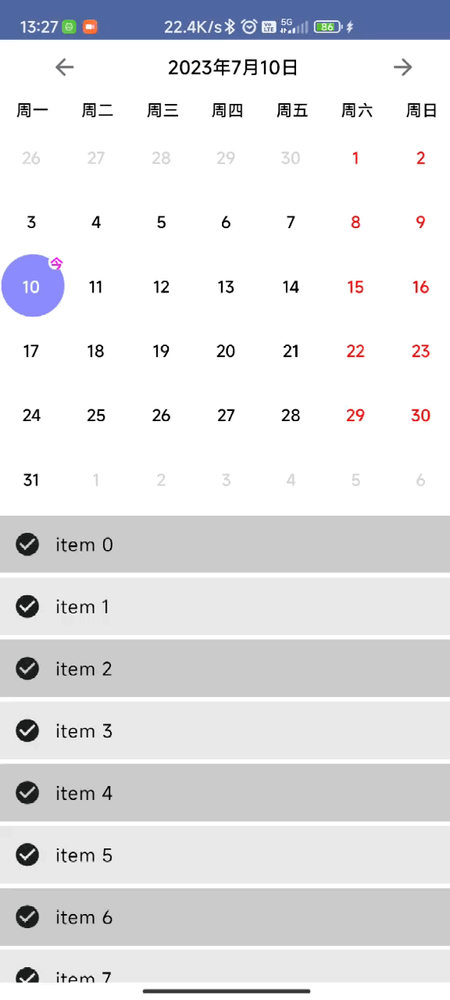

# 日历的绘制

<video src="./art/video.mp4" ></video>

### Compose UI实现
关键类和技术
- HorizontalPager
- Canvas 日期的绘制
- 点击事件的处理
- Calendar 日期的计算

### 待实现...
   - 1.周几为每周的起始日、模式切换
   - 2.UI的美化
   - 3.快速回到某一天
   - 4.发布到Maven仓库

